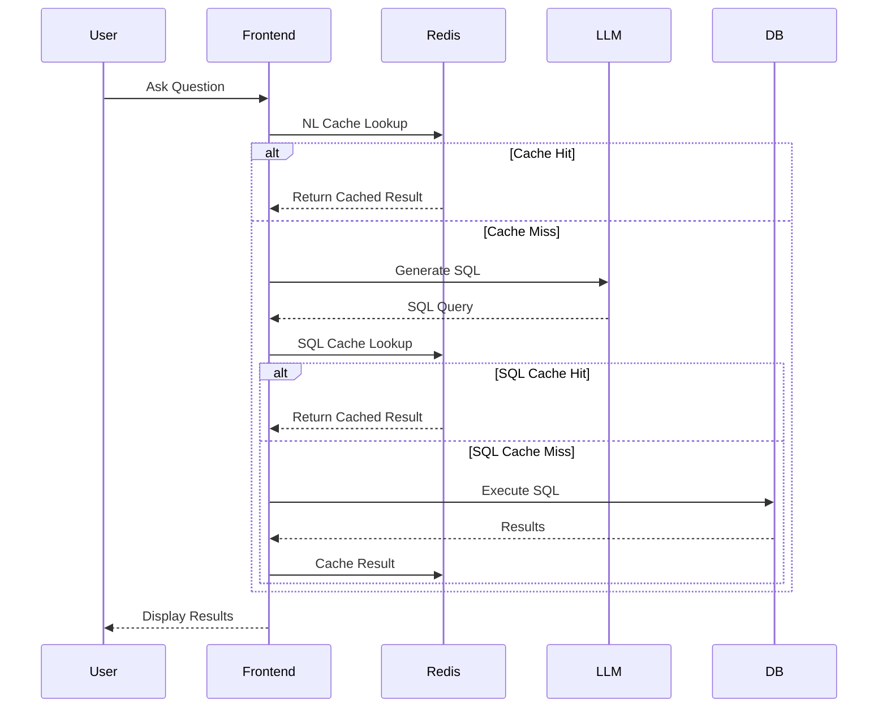

# EchoSQL Documentation

## Table of Contents
1. [User Guide](#user-guide)
2. [Technical Architecture](#technical-architecture)
3. [System Components](#system-components)
4. [Sequence Diagram](#sequence-diagram)

---

## User Guide
EchoSQL is a natural language interface for your banking database.

### Getting Started
1. **Ask a Question**: Type your query in plain English (e.g., "Show me top customers by balance").
2. **View Results**: The system generates a SQL query, executes it, and displays the results in a table.
3. **Explore Schema**: Navigate to the "Schema & Help" tab to understand your database structure.
4. **Monitor Health**: Check the "Observability" tab for real-time status of API, Database, Redis, and LLM services.

---

## Technical Architecture
EchoSQL is a single-host, local-first system designed for security and performance.

### Overview
- **Frontend**: Next.js 13 (Pages Router, TypeScript, SWR).
- **Backend**: FastAPI (Python 3.10+).
- **LLM**: Local Ollama (qwen:7b-chat).
- **Database**: PostgreSQL + pgvector (HNSW index).
- **Cache**: Redis (NL query & SQL result caching).
- **Observability**: OpenTelemetry (JSONL) → Tempo, Loki, Grafana.

---

## System Components

### Backend Routes
- `/api/query`: Handles NL-to-SQL translation, validation, and execution. Includes an input guardrail to ensure queries are data-related.
- `/api/schema`: Returns database schema metadata.
- `/health`: Service health status.

### Services
- `db_service.py`: Async database interactions.
- `embedding_service.py`: Vector generation for semantic search.
- `llm_service.py`: Ollama integration.
- `redis_cache.py`: Two-layer caching logic.

### Frontend
- `components/`: Reusable UI components (QueryHistory, ResultsTable).
- `lib/api.ts`: API client layer.
- `styles/`: Global CSS and component-specific styles.

### Security
- Environment variables are used for sensitive configuration (e.g., `DATABASE_URL`).
- `.env` files are excluded from version control via `.gitignore`.

---

## Sequence Diagram

